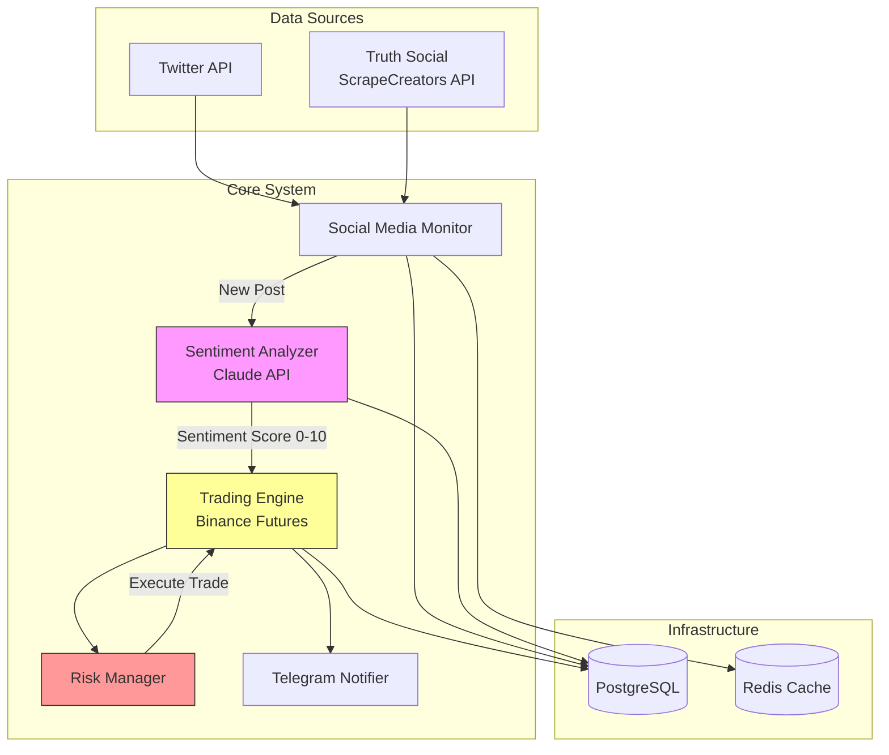
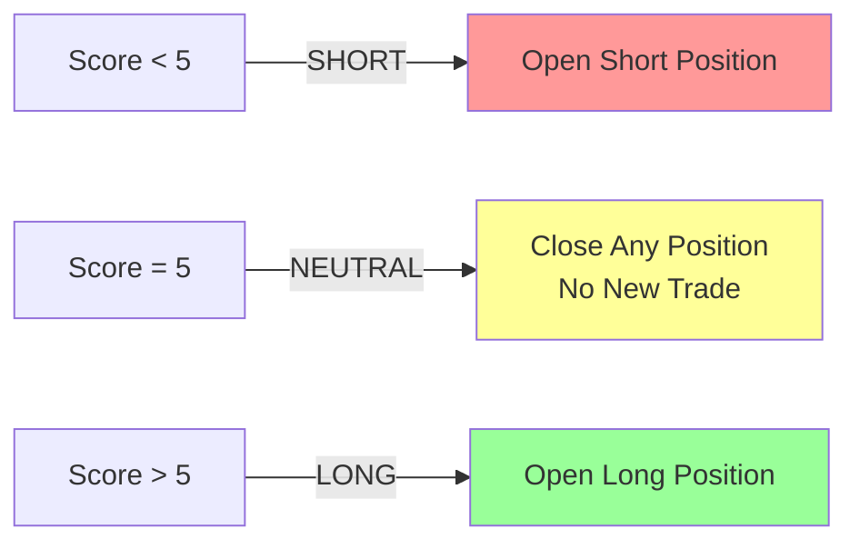
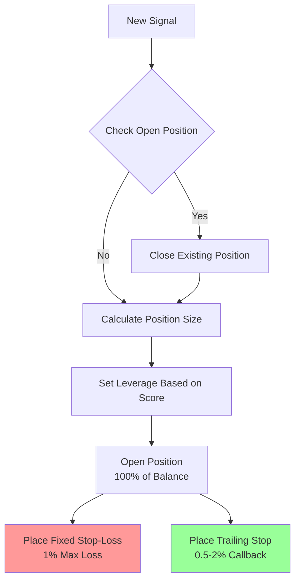

# Trump Social Media Trading Bot

Automated cryptocurrency trading system that monitors Donald Trump's Twitter and Truth Social posts, analyzes sentiment using Claude AI, and executes leveraged BTC futures trades on Binance with dynamic risk management.

## System Architecture



## Trading Logic

### Sentiment Score to Action Mapping



### Leverage Based on Score

| Score | Sentiment | Leverage | Position |
|-------|-----------|----------|----------|
| 0 | Extreme Bearish | 50x | SHORT |
| 1 | Very Bearish | 30x | SHORT |
| 2 | Bearish | 15x | SHORT |
| 3 | Somewhat Bearish | 10x | SHORT |
| 4 | Slightly Bearish | 3x | SHORT |
| **5** | **Neutral** | **0x** | **NO POSITION** |
| 6 | Slightly Bullish | 3x | LONG |
| 7 | Somewhat Bullish | 10x | LONG |
| 8 | Bullish | 15x | LONG |
| 9 | Very Bullish | 30x | LONG |
| 10 | Extreme Bullish | 50x | LONG |

### Risk Management



**Risk Limits:**
- **Fixed Stop-Loss:** Maximum 1% account loss per trade
- **Trailing Stop Callback:** Maximum 2% for all leverage levels
- **Position Management:** Only 1 position open at a time
- **Position Sizing:** 100% of available balance used per trade

### Dual Stop-Loss Strategy

| Leverage | Fixed SL | Trailing Callback | Max Loss |
|----------|----------|-------------------|----------|
| 50x | 1.0% | 0.5% | ~1% |
| 30x | 1.0% | 0.8% | ~1% |
| 15x | 1.0% | 1.2% | ~1% |
| 10x | 1.0% | 1.5% | ~1% |
| 3x | 1.0% | 2.0% | ~1% |

## Project Structure

```
trump_trader/
├── config/
│   ├── __init__.py
│   └── settings.py              # Pydantic settings with validation
├── src/
│   ├── monitors/
│   │   ├── twitter_monitor.py   # Real-time Twitter streaming
│   │   └── truthsocial_scraper.py # ScrapeCreators API integration
│   ├── analysis/
│   │   └── sentiment_analyzer.py # Claude API sentiment scoring
│   ├── trading/
│   │   ├── binance_client.py    # Binance Futures API wrapper
│   │   ├── position_manager.py  # Position lifecycle management
│   │   └── risk_manager.py      # Risk calculations & safety
│   ├── notifications/
│   │   └── telegram_bot.py      # Telegram channel updates
│   ├── database/
│   │   ├── models.py            # SQLAlchemy ORM models
│   │   └── repository.py        # Database operations
│   └── utils/
│       ├── logger.py            # Logging configuration
│       └── helpers.py           # Utility functions
├── tests/                       # Atomic test suite
├── docker-compose.yml           # PostgreSQL + Redis
├── requirements.txt
└── README.md (this file)
```

## Setup Instructions

### 1. Prerequisites

- Python 3.11+
- Docker & Docker Compose
- API Keys (see below)

### 2. Clone and Install

```bash
# Clone repository
cd /Users/siempi/Documents/repo/trump_trader

# Create virtual environment
python3 -m venv venv
source venv/bin/activate

# Install dependencies
pip install -r requirements.txt
```

### 3. Start Infrastructure

```bash
# Start PostgreSQL and Redis
docker-compose up -d

# Verify services are running
docker-compose ps
```

### 4. Configure Environment

Copy `.env.example` to `.env` and fill in your API keys:

```bash
cp .env.example .env
```

Required API keys:
- **Twitter API:** https://developer.twitter.com/
- **ScrapeCreators API:** https://scrapecreators.com/
- **Anthropic Claude API:** https://console.anthropic.com/
- **Binance Testnet API:** https://testnet.binancefuture.com/
- **Telegram Bot Token:** via @BotFather

### 5. Initialize Database

```bash
python -c "from src.database import DatabaseRepository; DatabaseRepository().create_tables()"
```

### 6. Run Tests

```bash
# Run all tests
pytest

# Run with coverage
pytest --cov=src --cov-report=html
```

### 7. Start Application

```bash
python src/main.py
```

## Current Implementation Status

✅ **Completed:**
- Project structure and configuration
- Database models and repository
- Utility functions with full test coverage
- Docker infrastructure setup
- Settings validation with Pydantic

🚧 **In Progress:**
- Social media monitors (Twitter + Truth Social)
- Sentiment analyzer (Claude API integration)
- Trading engine (Binance Futures)
- Risk management module
- Telegram notifications
- Main application orchestrator

## API Keys Required

### 1. Twitter API
- Go to: https://developer.twitter.com/
- Create app and get API keys
- Minimum tier: Basic ($100/month)
- Add to `.env`: `TWITTER_BEARER_TOKEN`

### 2. Truth Social (ScrapeCreators)
- Go to: https://scrapecreators.com/
- Sign up for API access
- Add to `.env`: `SCRAPECREATORS_API_KEY`

### 3. Anthropic Claude
- Go to: https://console.anthropic.com/
- Create API key
- Model: Claude 3.5 Sonnet
- Add to `.env`: `ANTHROPIC_API_KEY`

### 4. Binance Testnet
- Go to: https://testnet.binancefuture.com/
- Create account and generate API keys
- Enable Futures trading
- Add to `.env`: `BINANCE_API_KEY`, `BINANCE_API_SECRET`

### 5. Telegram Bot
- Message @BotFather on Telegram
- Create new bot with `/newbot`
- Get bot token
- Create channel and add bot as admin
- Get channel ID
- Add to `.env`: `TELEGRAM_BOT_TOKEN`, `TELEGRAM_CHANNEL_ID`

## Testing

Run atomic tests:
```bash
# All tests
pytest

# Specific test file
pytest tests/test_utils.py

# With coverage
pytest --cov=src --cov-report=term-missing
```

## Monitoring & Logs

- **Application Logs:** Console output (configurable level)
- **Database Logs:** `system_logs` table
- **Telegram Notifications:** Real-time updates in channel
- **Trade History:** `trades` table with full audit trail

## Safety Features

1. **Dry Run Mode:** Test without real trades (`DRY_RUN_MODE=true`)
2. **Testnet Support:** Practice with Binance testnet
3. **Hard Stop-Loss:** Never exceeds 1% account loss
4. **Leverage Limits:** Maximum 50x, validated in settings
5. **Single Position:** Only 1 open position at a time
6. **Circuit Breaker:** Stops after 3 consecutive failures

## Cost Estimates (Monthly)

| Service | Cost |
|---------|------|
| Twitter API | $100 |
| ScrapeCreators API | $20-50 |
| Anthropic Claude API | $50-100 |
| AWS (Tokyo Region) | $50-100 |
| **Total** | **$220-350/month** |

## Emergency Procedures

### Stop Trading Immediately
```bash
# Kill application
pkill -f "python src/main.py"

# Close all positions manually via Binance web interface
```

### Database Backup
```bash
docker exec trump_trader_postgres pg_dump -U trump_trader trump_trader > backup_$(date +%Y%m%d).sql
```

## Support & Issues

For issues or questions, review:
1. Application logs
2. `system_logs` database table
3. Telegram error alerts

## License

Private - Not for distribution

---

**⚠️ RISK WARNING:** Trading with leverage carries substantial risk. This system can result in complete loss of capital. Use at your own risk.

